# C# Algorithms
A collection of Design Patterns and Algorithms, implemented in C#.

### Prereqs

You will need .NET 8 Runtime/SDK in order to code / build. Additionally, it helps to use an IDE. I recommend Visual Studio.

- [Install .NET 8 SDK/Runtime Interactively](https://dotnet.microsoft.com/en-us/download/dotnet/8.0)
- [Install Visual Studio Preview](https://visualstudio.microsoft.com/vs/preview/)

OR use [WinGet](https://learn.microsoft.com/en-us/windows/package-manager/winget/)

```
winget install dotnet-runtime-8
winget install dotnet-sdk-8
winget install Microsoft.VisualStudio.2022.Community.Preview
```

### Project Layout

The [Patterns](https://github.com/JustinRidings/CSharpAlgorithms/tree/main/Patterns) directory contains sub-directories for the different types of design patterns that exist, align with implementations. The [WhiteboardSolutions.cs](https://github.com/JustinRidings/CSharpAlgorithms/blob/main/WhiteboardSolutions.cs) file contains static implementations for various whiteboarding questions. You can Demo each pattern or whiteboard solution by running the [Program](https://github.com/JustinRidings/CSharpAlgorithms/blob/main/Program.cs) to see the output.

### Behavioral Patterns

- [Iterator](https://github.com/JustinRidings/CSharpAlgorithms/blob/main/Patterns/Behavioral/BurgerMenuIterator.cs)
  - **Summary**: Provides a way to access elements of a collection sequentially without exposing its underlying representation.
  - **When to use**: When you need to traverse a collection without exposing its internal structure.

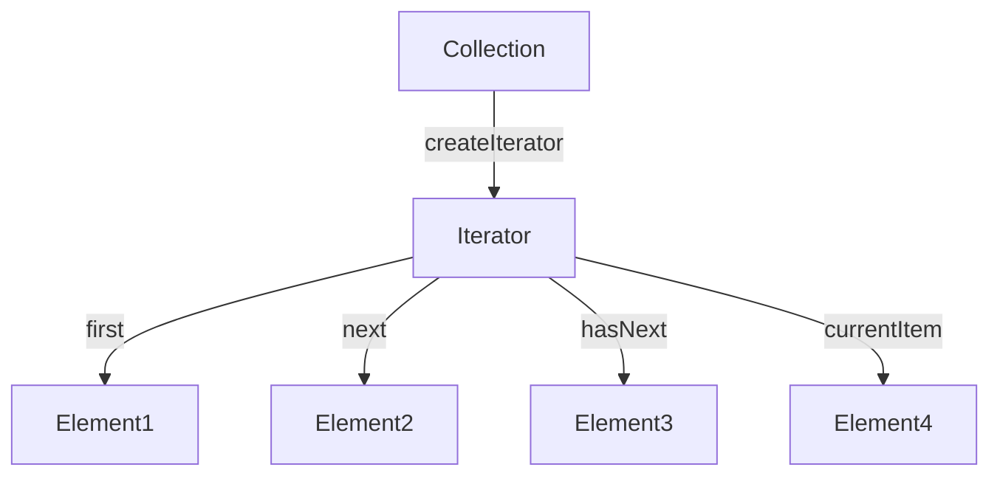
- [Observer](https://github.com/JustinRidings/CSharpAlgorithms/blob/main/Patterns/Behavioral/BurgerObserver.cs)
  - **Summary**: Defines a one-to-many dependency between objects so that when one object changes state, all its dependents are notified and updated automatically.
  - **When to use**: When changes to one object need to be propagated to multiple dependent objects automatically.

 ```mermaid
graph TD
A[Subject] -->|registerObserver| B[Observer1]
A -->|removeObserver| C[Observer2]
A -->|notifyObservers| D[Observer3]
B -->|update| E[Observer1State]
C -->|update| F[Observer2State]
D -->|update| G[Observer3State]
```

- [Strategy](https://github.com/JustinRidings/CSharpAlgorithms/blob/main/Patterns/Behavioral/CookingStrategy.cs)
  - **Summary**: Defines a family of algorithms, encapsulates each one, and makes them interchangeable. The strategy pattern lets the algorithm vary independently from the clients that use it.
  - **When to use**: When you have multiple algorithms for a specific task and want to switch between them dynamically.
 
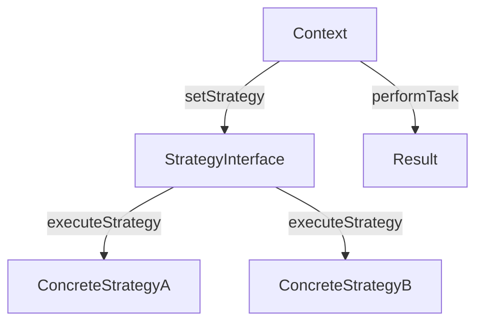

- [Command](https://github.com/JustinRidings/CSharpAlgorithms/blob/main/Patterns/Behavioral/LightCommand.cs)
  - **Summary**: Encapsulates a request as an object, thereby allowing for parameterization of clients with queues, requests, and operations.
  - **When to use**: When you need to parameterize objects with operations, delay execution, or support undoable operations.
 
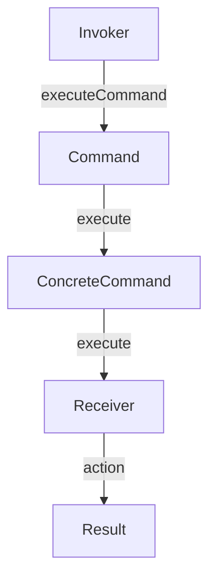

- [State](https://github.com/JustinRidings/CSharpAlgorithms/blob/main/Patterns/Behavioral/VendingMachineState.cs)
  - **Summary**: Allows an object to alter its behavior when its internal state changes. The object will appear to change its class.
  - **When to use**: When an object's behavior depends on its state, and it needs to change behavior at runtime depending on its current state.
 
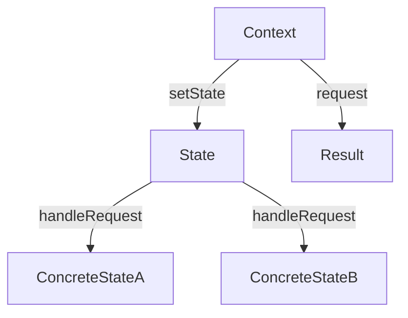

- [Mediator](https://github.com/JustinRidings/CSharpAlgorithms/blob/main/Patterns/Behavioral/ChatMediator.cs)
  - **Summary**: Defines an object that encapsulates how a set of objects interact. This pattern promotes loose coupling by keeping objects from referring to each other explicitly and allows their interaction to be varied independently.
  - **When to use**: When you need to reduce the complexity of communication between multiple objects and centralize the interaction logic.
 
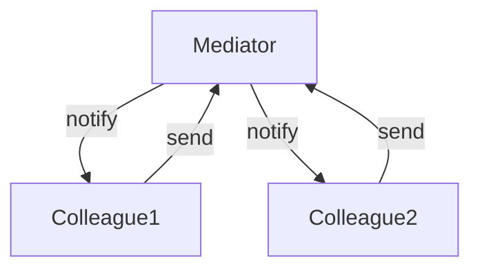

- [Chain of Responsibility](https://github.com/JustinRidings/CSharpAlgorithms/blob/main/Patterns/Behavioral/SupportChainOfResponsibility.cs)
  - **Summary**: Allows a request to pass through a chain of handlers. Each handler either processes the request or passes it to the next handler in the chain.
  - **When to use**: When multiple objects can handle a request, and you want to avoid coupling the sender to a specific receiver.

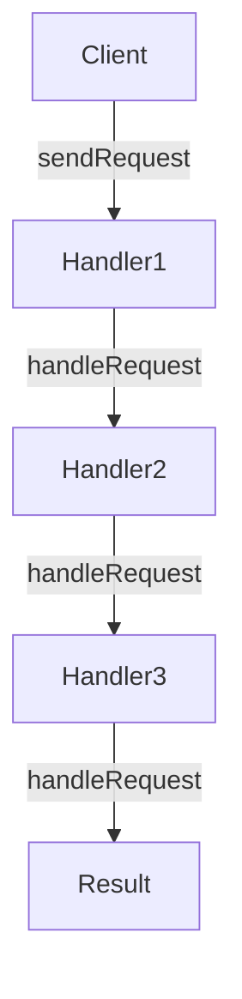

- [Visitor](https://github.com/JustinRidings/CSharpAlgorithms/blob/main/Patterns/Behavioral/ShoppingVisitor.cs)
  - **Summary**: When you need to perform various operations on objects without changing their classes.
  - **When to use**: When you want to separate an algorithm from the objects on which it operates.

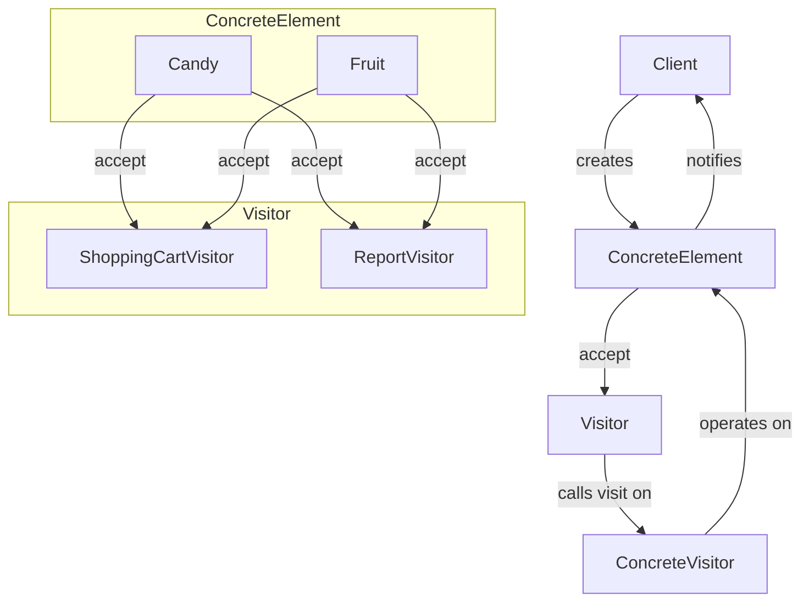

- [Template Method](https://github.com/JustinRidings/CSharpAlgorithms/blob/main/Patterns/Behavioral/DocumentTemplateMethod.cs)
  - **Summary**: Defines the skeleton of an algorithm in a method, allowing subclasses to redefine certain steps without changing the algorithm's structure.
  - **When to use**: When you need to define the general flow of an algorithm but allow subclasses to customize specific steps.

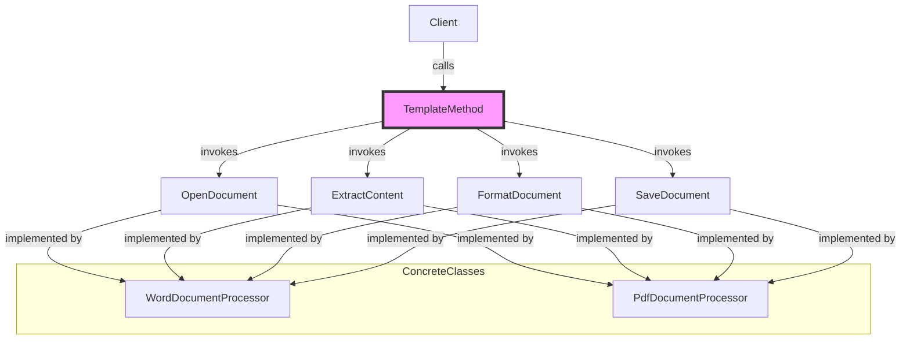

- [Memento](https://github.com/JustinRidings/CSharpAlgorithms/blob/main/Patterns/Behavioral/TextMemento.cs)
  - **Summary**: Captures and externalizes an object's internal state without violating encapsulation, so that the object can be restored to this state later.
  - **When to use**: When you need to implement a feature that allows an object to be restored to a previous state, such as undo operations in text editors or maintaining historical states.

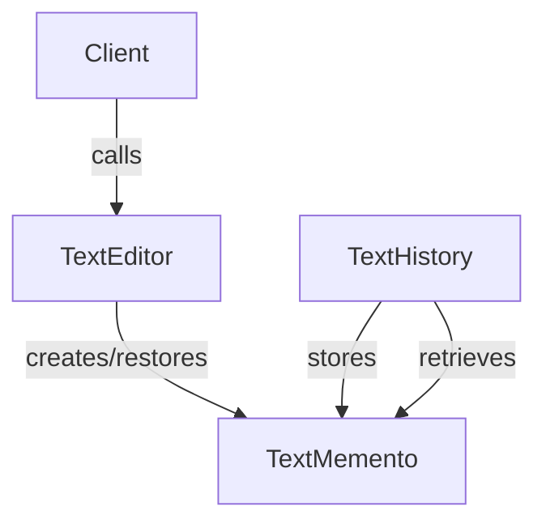

### Creational Patterns

- [Builder](https://github.com/JustinRidings/CSharpAlgorithms/blob/main/Patterns/Creational/CarBuilder.cs)
  - **Summary**: Separates the construction of a complex object from its representation so that the same construction process can create different representations.
  - **When to use**: When you need to construct complex objects step by step and allow for different representations.

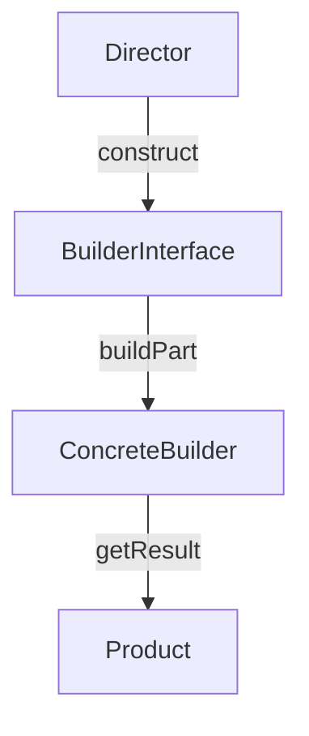

- [Factory](https://github.com/JustinRidings/CSharpAlgorithms/blob/main/Patterns/Creational/CarFactory.cs)
  - **Summary**: Defines an interface for creating an object, but lets subclasses alter the type of objects that will be created.
  - **When to use**: When you need to delegate the instantiation logic to subclasses or to centralize the creation logic for a specific type of object.
 
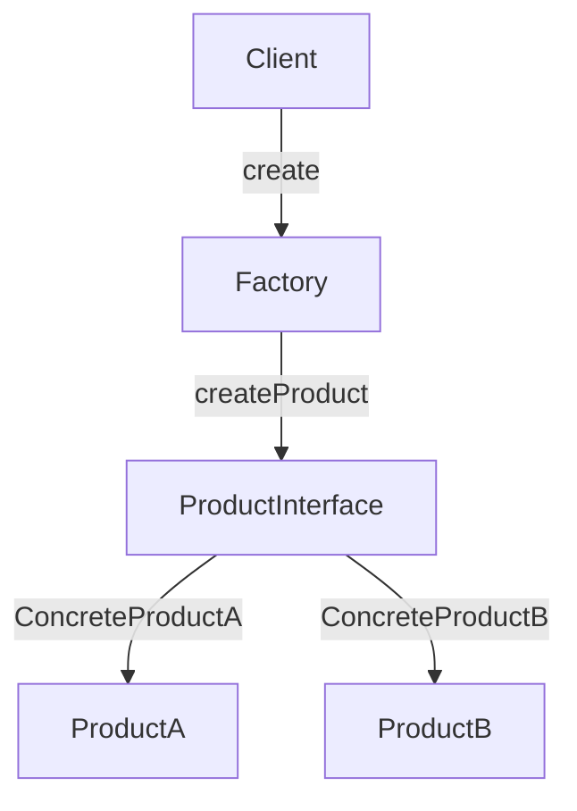

- [Singleton](https://github.com/JustinRidings/CSharpAlgorithms/blob/main/Patterns/Creational/CarSingleton.cs)
  - **Summary**: Ensures a class has only one instance and provides a global point of access to it.
  - **When to use**: When you need exactly one instance of a class to control access to shared resources.
 
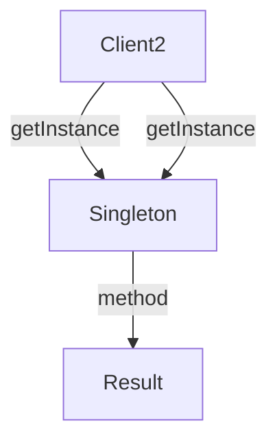

- [LazyLoading](https://github.com/JustinRidings/CSharpAlgorithms/blob/main/Patterns/Creational/OrderLazy.cs)
  - **Summary**: Delays the initialization of an object until it is actually needed, which can improve performance and reduce memory usage.
  - **When to use**: When you want to defer the initialization of an object until it's really needed to save resources.
 
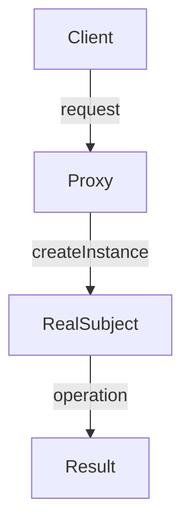

- [Prototype](https://github.com/JustinRidings/CSharpAlgorithms/blob/main/Patterns/Creational/GameCharacterPrototype.cs)
  - **Summary**: Allows you to copy existing objects without making your code dependent on their classes.
  - **When to use**: When creating new instances of a class is expensive or complicated, or when you want to replicate an object configuration with minor changes.

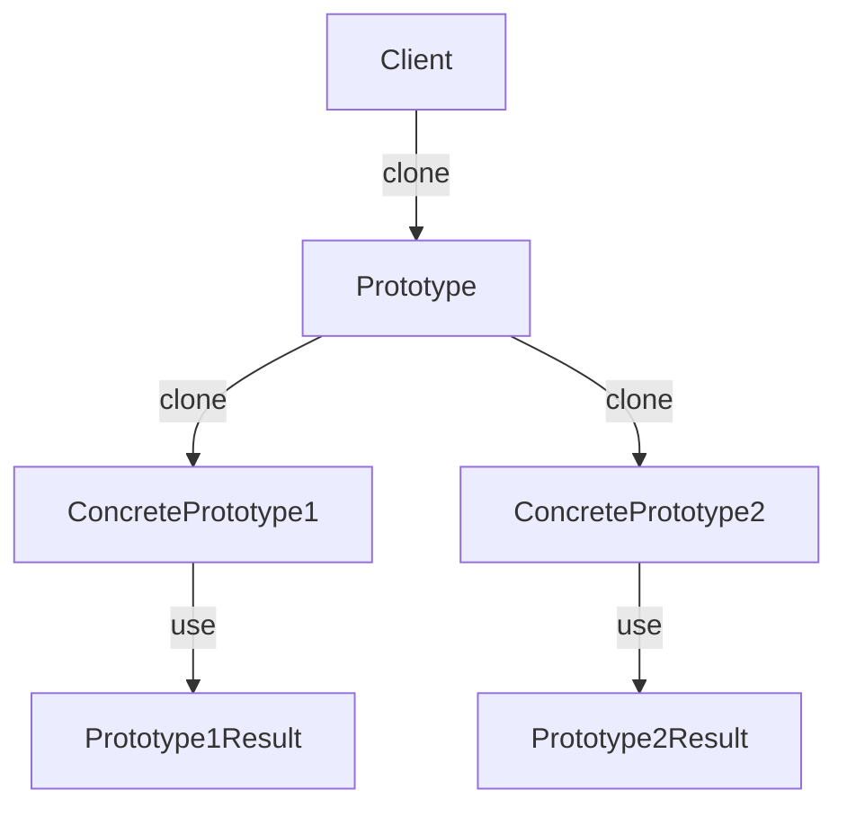

- [Abstract Factory](https://github.com/JustinRidings/CSharpAlgorithms/blob/main/Patterns/Creational/AbstractFactory.cs)
  - **Summary**: Provides an interface for creating families of related or dependent objects without specifying their concrete classes.
  - **When to use**: When a system needs to be independent of how its objects are created, composed, and represented, or when a system should be configured with one of multiple families of products.

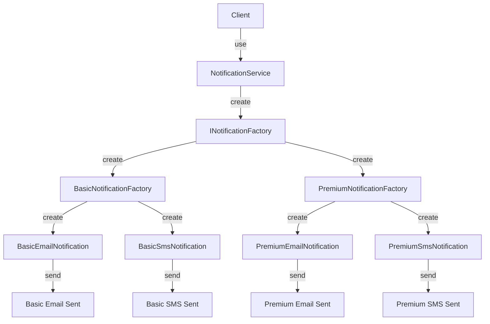

### Structural Patterns

- [Facade](https://github.com/JustinRidings/CSharpAlgorithms/blob/main/Patterns/Structural/BookstoreFacade.cs)
  - **Summary**: Provides a unified interface to a set of interfaces in a subsystem, making the subsystem easier to use.
  - **When to use**: When you need to simplify interactions with a complex system by providing a unified interface.
 
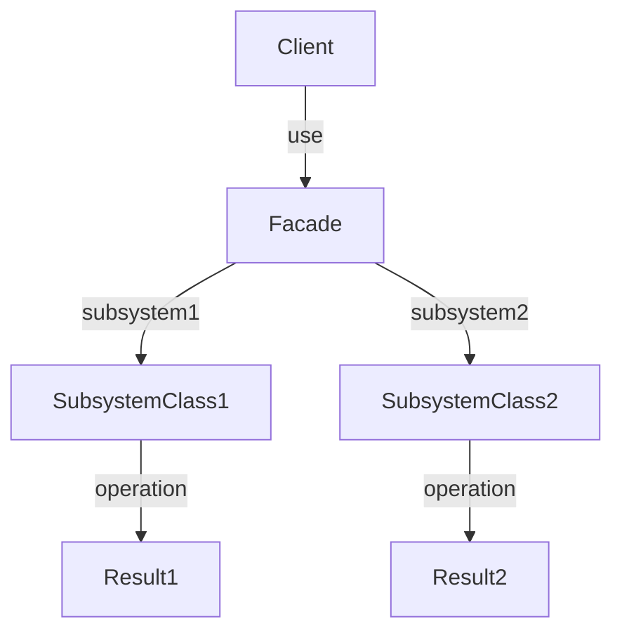

- [Adapter](https://github.com/JustinRidings/CSharpAlgorithms/blob/main/Patterns/Structural/MagazineAdapter.cs)
  - **Summary**: Converts the interface of a class into another interface the clients expect. Adapter lets classes work together that couldn't otherwise because of incompatible interfaces.
  - **When to use**: When you need to integrate a new class that doesn't fit the existing interface or legacy system.
 
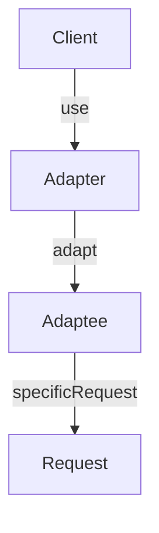

- [Decorator](https://github.com/JustinRidings/CSharpAlgorithms/blob/main/Patterns/Structural/BeverageDecorator.cs)
  - **Summary**: Attaches additional responsibilities to an object dynamically. Decorators provide a flexible alternative to subclassing for extending functionality.
  - **When to use**: When you need to add behaviors or responsibilities to objects dynamically without modifying their code.
 
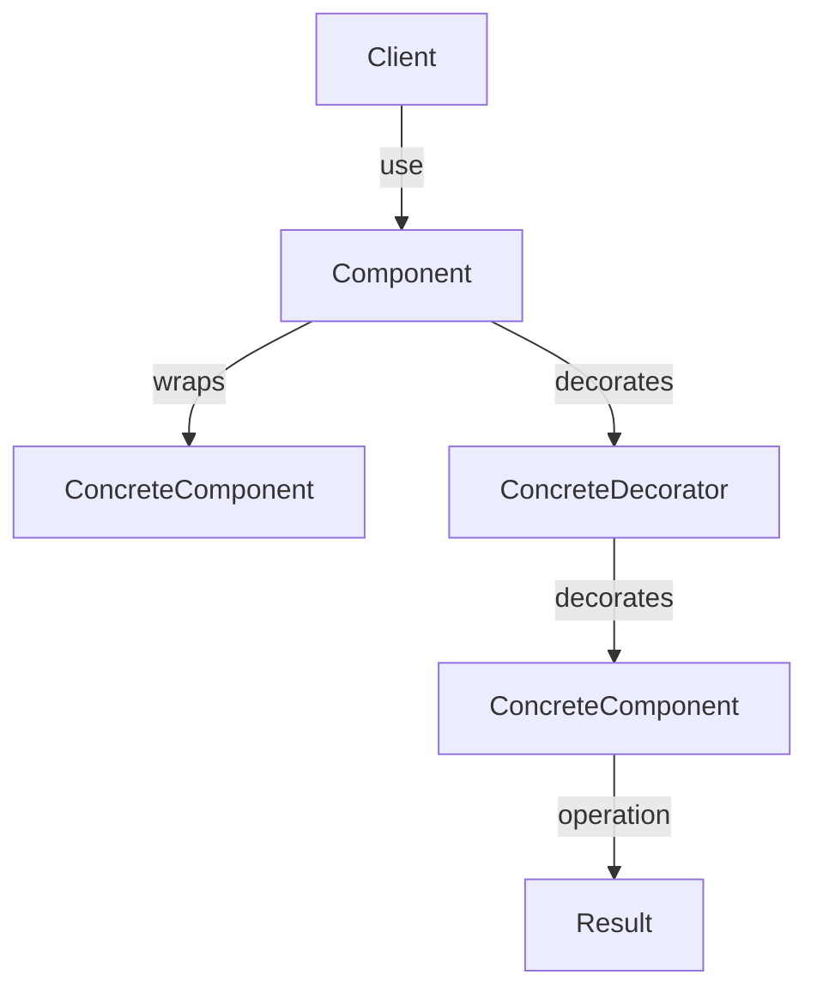

- [Composite](https://github.com/JustinRidings/CSharpAlgorithms/blob/main/Patterns/Structural/ComponentComposite.cs)
  - **Summary**: Composes objects into tree structures to represent part-whole hierarchies. Composite lets clients treat individual objects and compositions of objects uniformly.
  - **When to use**: When you need to work with tree structures and treat individual objects and compositions uniformly.

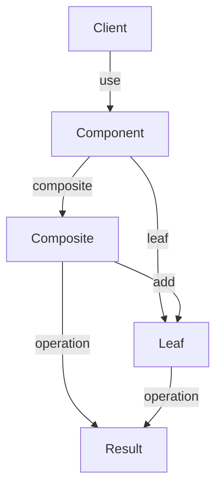

- [Flyweight](https://github.com/JustinRidings/CSharpAlgorithms/blob/main/Patterns/Structural/TreeFlyweight.cs)
  - **Summary**: Minimizes memory usage by sharing as much data as possible with similar objects.
  - **When to use**: When an application uses a large number of objects that share common properties, and you want to reduce memory consumption and improve performance by sharing common data.

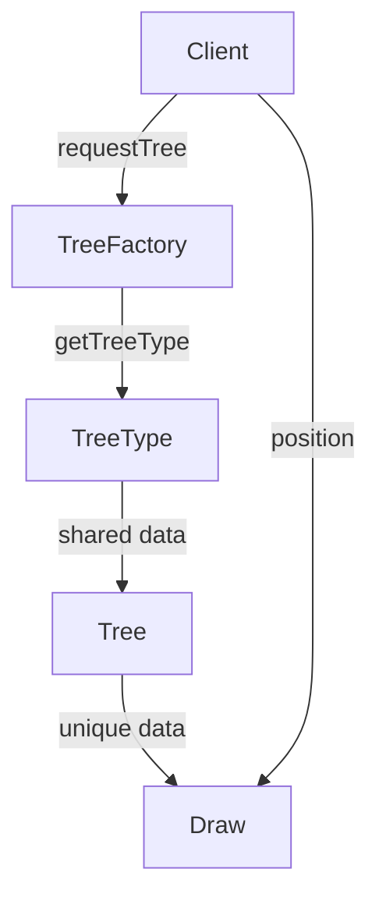

- [Proxy](https://github.com/JustinRidings/CSharpAlgorithms/blob/main/Patterns/Structural/BankProxy.cs)
  - **Summary**: Provides a surrogate or placeholder for another object to control access to it.
  - **When to use**: When you need to control access to an object, add additional functionality such as logging or authentication, or work with remote objects or objects that are expensive to create.

```mermaid
graph TD
    A[Client] -->|request| B[Proxy]
    B -->|authenticate| C[RealSubject]
    B -->|log request| D[Logger]
    C -->|execute| E[Result]
    D -->|store log| F[LogStorage]
    A -->|get result| E
```

- [Bridge](https://github.com/JustinRidings/CSharpAlgorithms/blob/main/Patterns/Structural/ShapeBridge.cs)
  - **Summary**: Decouples an abstraction from its implementation, allowing them to vary independently. Useful for avoiding a permanent binding between an abstraction and its implementation.
  - **When to use**: When you need to separate the abstraction of a concept from its actual implementation, allowing both to be developed and extended independently.
 
```mermaid
graph TD
    A[Client] -->|calls| B[Shape]
    B -->|uses| C[IColor]
    B -->|uses| D[Circle]
    B -->|uses| E[Rectangle]
    C -->|implements| F[RedColor]
    C -->|implements| G[BlueColor]
    D -->|uses| H[RedColor]
    D -->|uses| I[BlueColor]
    E -->|uses| J[RedColor]
    E -->|uses| K[BlueColor]
    F -->|operation| L[ApplyColor]
    G -->|operation| M[ApplyColor]
    H -->|operation| N[Draw]
    I -->|operation| O[Draw]
    J -->|operation| P[Draw]
    K -->|operation| Q[Draw]
```
